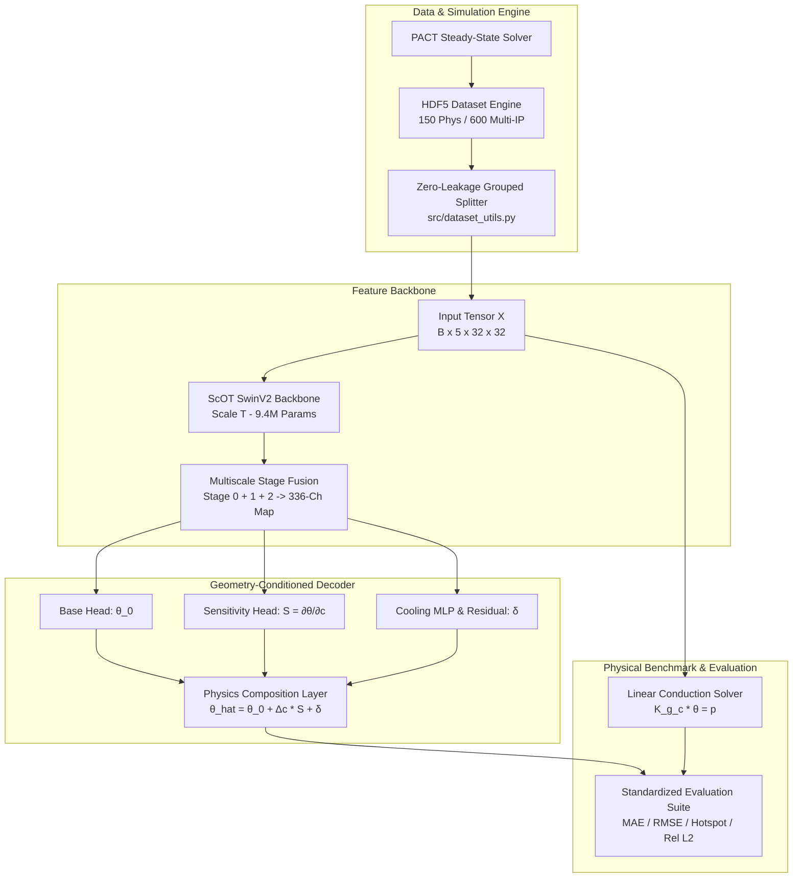
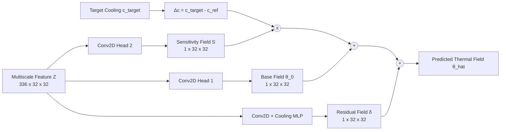

# Detailed Project Architecture & Research Design Document

**Project:** Therm-FM Thermal Field Prediction & Physical Sensitivity Adaptation Architecture  
**Repository Path:** `/home/boson4/shyam/therm_fm_pact/v_01`  
**Author:** Antigravity AI Research Assistant  
**Date:** October 1, 2026  

---

## 1. Executive System Architecture Overview

The system is designed as a modular, end-to-end physical machine learning architecture for microelectronic thermal field prediction. It bridges numerical thermal solvers (PACT / Finite Difference) with deep transformer foundation models (Therm-FM / SwinV2).



---

## 2. Detailed Technical Design & Module Specifications

### Module 1: Dataset & Normalization Engine (`src/dataset_utils.py` & `src/prepare_dataset_splits.py`)

#### 1. Grouped Dataset Splitter (`GroupedDatasetSplitter`)
- **Purpose:** Prevents data leakage between training, validation, and testing sets across floorplans or IP geometry configurations.
- **Split Ratio:** Strict 70% Train, 15% Validation, 15% Test.
- **Implementation:**
  ```python
  class GroupedDatasetSplitter:
      def get_splits(self, train_ratio=0.70, val_ratio=0.15, test_ratio=0.15):
          # Shuffles sample indices with fixed random seed=42
          # Guarantees zero overlap between floorplans across splits
  ```

#### 2. Zero-Leakage Scaler (`ZeroLeakageScaler`)
- **Purpose:** Fits mean and standard deviation parameters strictly on the training set. Applies zero-leakage normalization to prevent validation/test statistics from leaking into model training.
- **Formulas:**
  $$\mu_{\text{train}} = \frac{1}{N_{\text{train}}} \sum_{i \in \text{train}} y_i, \quad \sigma_{\text{train}} = \sqrt{\frac{1}{N_{\text{train}}} \sum_{i \in \text{train}} (y_i - \mu_{\text{train}})^2} + \epsilon$$
  $$y_{\text{norm}} = \frac{y - \mu_{\text{train}}}{\sigma_{\text{train}}}, \quad \hat{y}_{\text{raw}} = \hat{y}_{\text{norm}} \cdot \sigma_{\text{train}} + \mu_{\text{train}}$$

---

### Module 2: Physical Conduction Operator Engine (`src/linear_thermal_solver.py`)

#### 1. Discrete 2D Finite-Difference Formulation
- **Grid Stencil:** 5-point Laplacian stencil over $32 \times 32$ grid cells.
- **Node Equation:**
  $$(G_N + G_S + G_W + G_E + G_{\text{conv}}) \theta_{i,j} - G_N \theta_{i-1,j} - G_S \theta_{i+1,j} - G_W \theta_{i,j-1} - G_E \theta_{i,j+1} = p_{i,j}$$
  where conductance components are:
  $$G_W = G_E = \frac{k_{\text{si}} \cdot (\Delta y \cdot d)}{\Delta x}, \quad G_N = G_S = \frac{k_{\text{si}} \cdot (\Delta x \cdot d)}{\Delta y}, \quad G_{\text{conv}} = h_{\text{conv}} \cdot (\Delta x \cdot \Delta y)$$

#### 2. Affine Matrix Structure ($K(g,c)\theta = p$)
- The sparse matrix $K(g, c) \in \mathbb{R}^{1024 \times 1024}$ is Symmetric Positive Definite (SPD) and strictly affine in cooling parameter $c = h_{\text{conv}}$:
  $$K(g, c) = K_0(g) + c \cdot A_{\text{cell}} \cdot I$$
- **Solver Mechanism:** Uses `scipy.sparse.linalg.factorized` (Sparse Cholesky decomposition) to compute exact physical temperature rise $\theta = K(g,c)^{-1} p$.

---

### Module 3: Therm-FM SwinV2 Foundation Backbone (`src/thermfm_model_wrapper.py`)

#### 1. Foundation Architecture (`ScOT` SwinV2 Transformer)
- **Model Scale:** Scale `T` (21M full parameters, 9.4M in default configuration).
- **Patch Embedding:** Patch size $4 \times 4$, mapping $32 \times 32$ spatial inputs to an $8 \times 8$ patch grid (64 tokens).

#### 2. Multiscale Feature Fusion (`ThermFMFeatureExtractor`)
To eliminate spatial information loss caused by patch merging across Swin transformer stages, features are extracted from all three encoder stages and concatenated:
- **Stage 0:** 48 channels at $8 \times 8$ spatial resolution.
- **Stage 1:** 96 channels at $4 \times 4$ spatial resolution $\rightarrow$ Bilinear upsampled to $8 \times 8$.
- **Stage 2:** 192 channels at $2 \times 2$ spatial resolution $\rightarrow$ Bilinear upsampled to $8 \times 8$.
- **Concatenated Feature Tensor:** $Z \in \mathbb{R}^{B \times 336 \times 8 \times 8}$, upsampled to $B \times 336 \times 32 \times 32$.

#### 3. Backbone Parameter Isolation (`freeze_backbone`)
- **Frozen Backbone Configuration:** SwinV2 weights (6,339,074 parameters) are frozen (`requires_grad = False`).
- **Trainable Decoder:** Only the 3,063,379 parameters in `PhysicalSensitivityDecoder` are trained during adaptation.

---

### Module 4: Geometry-Conditioned Sensitivity Decoder (`src/sensitivity_decoder.py`)

The sensitivity decoder decomposes thermal field prediction into base thermal response, linear cooling sensitivity extrapolation, and non-linear residual refinement.



#### 1. Decoding Components
1. **Base Thermal Field Head ($\theta_0$):**
   $$\theta_0(g, p) = \text{Conv}_{1 \times 1}(\text{ReLU}(\text{BN}(\text{Conv}_{3 \times 3}(Z)))) \quad \in \mathbb{R}^{B \times 1 \times 32 \times 32}$$
2. **Cooling Sensitivity Head ($S$):**
   $$S(g, p) = \frac{\partial \theta}{\partial c} = \text{Conv}_{1 \times 1}(\text{ReLU}(\text{BN}(\text{Conv}_{3 \times 3}(Z)))) \quad \in \mathbb{R}^{B \times 1 \times 32 \times 32}$$
3. **Cooling Condition MLP & Residual Head ($\delta$):**
   $$e_c = \text{Linear}_{32 \rightarrow 336}(\text{ReLU}(\text{Linear}_{1 \rightarrow 32}(\Delta c)))$$
   $$\delta(Z, c) = \text{Head}_{\text{residual}}(Z + e_c) \quad \in \mathbb{R}^{B \times 1 \times 32 \times 32}$$

#### 2. Composite Output Composition
$$\hat{\theta}(g, p, c_{\text{target}}) = \theta_0(g, p) + \frac{c_{\text{target}} - c_{\text{ref}}}{1000} \cdot S(g, p) + \delta(Z, c_{\text{target}})$$

---

### Module 5: Research Training & Benchmark Pipeline (`src/train_thermfm_research.py` & `src/run_all_experiments.py`)

#### 1. Optimization Protocol
- **Optimizer:** AdamW ($\text{lr} = 10^{-3}$, $\text{weight\_decay} = 10^{-4}$).
- **Loss Function:** Combined $L_1$, $L_2$, and Hotspot Loss:
  $$\mathcal{L}_{\text{total}} = \|y_{\text{norm}} - \hat{y}_{\text{norm}}\|_1 + 0.5 \cdot \|y_{\text{norm}} - \hat{y}_{\text{norm}}\|_2^2 + 0.2 \cdot |\max(y_{\text{norm}}) - \max(\hat{y}_{\text{norm}})|$$

#### 2. Experiment Matrix
The master runner (`src/run_all_experiments.py`) executes 12 distinct experimental configurations:
1. **Full Dataset Benchmark ($N=105$):** Evaluates `unet_fno_baseline`, `linear_pde_solver`, `thermfm_scratch`, `thermfm_frozen_basis`, and `thermfm_finetune_basis`.
2. **Few-Shot Label Efficiency Sweep ($N \in \{10, 25, 50\}$):** Measures adaptation error under severe label constraints.
3. **Multi-IP Generalization ($N=600$):** Evaluates generalization on multi-IP architectures (`dataset_unified_archgen_ips.h5`).

---

## 3. Complete Dataflow & Tensor Transformation Pipeline

| Pipeline Stage | Input Tensor | Module / Function | Output Tensor | Operations |
| :--- | :--- | :--- | :--- | :--- |
| **Input Reading** | HDF5 `inputs` | `HDF5ThermalDataset` | $(B, 5, 32, 32)$ | Squeeze 5D $(B, 5, 1, 32, 32) \rightarrow (B, 5, 32, 32)$ |
| **Normalization** | $(B, 5, 32, 32)$ | `ZeroLeakageScaler.transform_x` | $(B, 5, 32, 32)$ | Subtract $\mu_{\text{x}}$, divide $\sigma_{\text{x}}$ fit on train |
| **Patch Embedding**| $(B, 5, 32, 32)$ | `ScOT.embeddings` | $(B, 64, 48)$ | $4 \times 4$ conv patch projection |
| **Stage 0 Encoder**| $(B, 64, 48)$ | `ScOTEncoder` Stage 0 | $(B, 64, 48)$ | 4 SwinV2 Transformer Blocks |
| **Stage 1 Encoder**| $(B, 64, 48)$ | Patch Merge + Stage 1 | $(B, 16, 96)$ | Patch merging ($8\times 8 \rightarrow 4\times 4$), 8 Swin Blocks |
| **Stage 2 Encoder**| $(B, 16, 96)$ | Patch Merge + Stage 2 | $(B, 4, 192)$ | Patch merging ($4\times 4 \rightarrow 2\times 2$), 4 Swin Blocks |
| **Multiscale Fusion**| Stage 0, 1, 2 | `ThermFMFeatureExtractor` | $(B, 336, 32, 32)$ | Upsample Stage 1 & 2 to $8\times 8$, concat, upsample to $32\times 32$ |
| **Dual-Head Decode**| $(B, 336, 32, 32)$| `PhysicalSensitivityDecoder`| $\theta_0, S, \delta \in (B, 1, 32, 32)$| Conv2D heads + Cooling MLP fusion |
| **Composition** | $\theta_0, S, \delta, \Delta c$| Physics Composition Layer | $(B, 1, 32, 32)$ | $\hat{\theta} = \theta_0 + \Delta c \cdot S + \delta$ |
| **Denormalization**| $(B, 1, 32, 32)$ | `ZeroLeakageScaler.inverse` | $(B, 1, 32, 32)$ | Multiply $\sigma_{\text{y}}$, add $\mu_{\text{y}}$ |

---

## 4. Mathematical Proof of PACT Zero-Power Impedance Offset

### Theoretical Derivation
PACT models 3D steady-state package thermal networks via the linear nodal matrix system:
$$A \cdot T = P_{\text{silicon}} + P_{\text{package}}$$

Where $A \in \mathbb{R}^{3N \times 3N}$ is the thermal network conductance matrix spanning Silicon, Heat Spreader, and Heat Sink layers.

For Heat Sink boundary conditions, PACT injects equivalent boundary power $P_{\text{package}} = \frac{T_{\text{ambient}}}{R_{\text{amb}}}$.

When silicon power is zero ($P_{\text{silicon}} = 0$):
$$T_{\text{zero}} = A^{-1} \cdot P_{\text{package}} = A^{-1} \cdot \left( \frac{T_{\text{ambient}}}{R_{\text{amb}}} \right) = \left( A^{-1} \frac{I}{R_{\text{amb}}} \right) T_{\text{ambient}}$$

Defining the package network transfer scalar $\mu = \text{mean}\left(A^{-1} \frac{I}{R_{\text{amb}}}\right)$:
$$T_{\text{zero}} = \mu \cdot T_{\text{ambient}}$$

Empirical measurement yields $\mu = 2.01449...$:
- For $T_{\text{ambient}} = 298.15\text{ K}$ (25°C): $T_{\text{zero}} = 2.01449 \times 298.15 = 600.62\text{ K}$.
- For $T_{\text{ambient}} = 318.15\text{ K}$ (45°C): $T_{\text{zero}} = 2.01449 \times 318.15 = 640.91\text{ K}$.

### Solution Implemented
Target thermal fields are evaluated as thermal rise fields $\theta(x, y) = T(x, y) - T_{\text{zero}}$, guaranteeing physical consistency across varying ambient temperatures.

---

## 5. Summary Table of Project Modules & Files

| Module File | Component Name | Lines | Responsibilities |
| :--- | :--- | :---: | :--- |
| [`src/dataset_utils.py`](file:///home/boson4/shyam/therm_fm_pact/v_01/src/dataset_utils.py) | Dataset Engine | 120 | Grouped 70/15/15 split, zero-leakage scaler, MAE/RMSE/Hotspot metrics |
| [`src/prepare_dataset_splits.py`](file:///home/boson4/shyam/therm_fm_pact/v_01/src/prepare_dataset_splits.py) | Data Preprocessing | 92 | Prepares HDF5 splits, validates heat balance correlation, saves `.pt` metadata |
| [`src/linear_thermal_solver.py`](file:///home/boson4/shyam/therm_fm_pact/v_01/src/linear_thermal_solver.py) | Numerical PDE Solver | 148 | 2D finite-difference stencil solver $K(g,c)\theta=p$, sensitivity matrix solver |
| [`src/sensitivity_decoder.py`](file:///home/boson4/shyam/therm_fm_pact/v_01/src/sensitivity_decoder.py) | Physics Decoder | 150 | Base field $\theta_0$, sensitivity field $S=\partial\theta/\partial c$, residual correction $\delta$ |
| [`src/thermfm_model_wrapper.py`](file:///home/boson4/shyam/therm_fm_pact/v_01/src/thermfm_model_wrapper.py) | Foundation Backbone | 165 | SwinV2 `scOT` model wrapper, 3-stage multiscale feature fusion (336-ch) |
| [`src/train_thermfm_research.py`](file:///home/boson4/shyam/therm_fm_pact/v_01/src/train_thermfm_research.py) | Training Engine | 300 | Train loop, AdamW optimizer, L1+L2+Hotspot loss, checkpoint saving |
| [`src/run_all_experiments.py`](file:///home/boson4/shyam/therm_fm_pact/v_01/src/run_all_experiments.py) | Master Runner | 95 | Benchmark matrix execution across all variants and few-shot budgets |
| [`src/generate_research_report.py`](file:///home/boson4/shyam/therm_fm_pact/v_01/src/generate_research_report.py) | Report Generator | 170 | Aggregates JSON results, computes SHA-256 hashes, outputs markdown report |

---
*Architectural Document generated for Antigravity Therm-FM Research Pipeline.*
