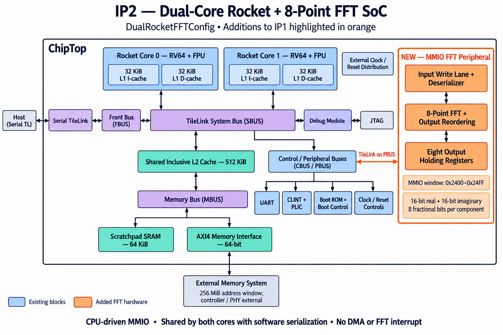

# IP2 — Dual-core Rocket with FFT

Two RV64 Rocket cores with private 32-KiB instruction/data caches, a shared
512-KiB inclusive L2, a 64-KiB scratchpad, and an added memory-mapped 8-point
complex FFT. Input and output components are signed 16-bit fixed point with
eight fractional bits. Both CPUs share one accelerator through PBUS.

* [Hardware inventory and FFT register interface](docs/SOC.md)
* [Pinned configuration and reproduction](docs/CONFIGURATION.md)
* [Original generated RTL](rtl/) — 488 source files, including simulation resources
* [CPU and multicore simulation](docs/reports/cpu/README.md) — all 335 configured
  ISA tests and 12 configured benchmarks passed; all 391 IP1 passes reproduced
* [FFT simulation](docs/reports/fft/README.md) — 9/9 normal runs, 2,433 transforms,
  and a correctly rejected corrupted-answer control
* [Full-SoC lint](docs/reports/lint/README.md) — zero errors in Verilator and slang;
  warnings retained
* [Full-SoC synthesis](docs/reports/synthesis/README.md)
* [Build evidence](docs/reports/build/README.md) and [upstream notices](third_party/README.md)

The FFT has no DMA, interrupt, programmable size, busy/done register, saturation,
or overflow flag. Its finite-width intermediate overflow behavior and software
ownership/completion contract are documented in the [tests](tests/README.md).
Simulation uses the original behavioral RTL. Exploratory Nangate45/fakeram45
synthesis is not placement/routing, timing closure, power analysis, foundry
implementation, or silicon signoff.

The broader 422-program CPU inventory retains 25 failures, four wall timeouts
and two cycle timeouts in unsupported probes and legacy test diagnostics.
These are reported explicitly; the package does not claim all 422 passed.
