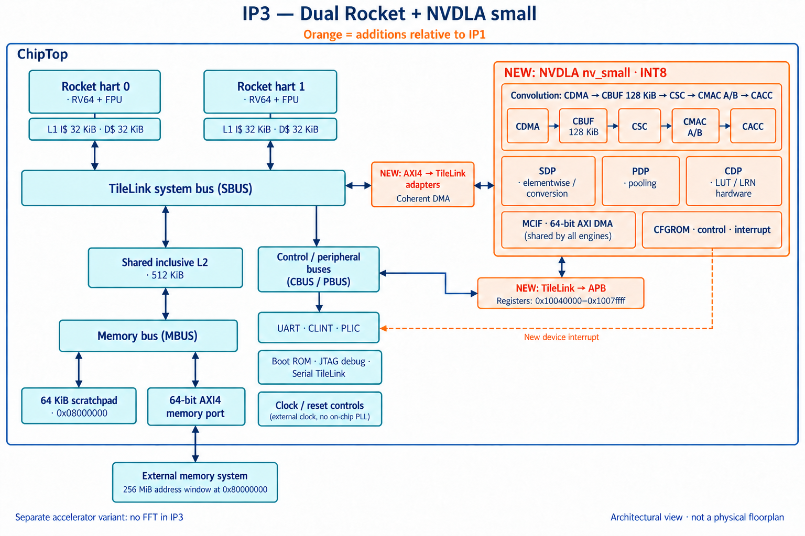

# IP3 — Dual-core Rocket with NVDLA small

Two RV64 Rocket cores with private instruction/data caches and a shared
inclusive L2, connected to the INT8 `nv_small` accelerator. NVDLA adds
convolution, elementwise arithmetic, pooling and lookup hardware, a 128-KiB
convolution buffer, coherent DMA, an APB control bridge and a PLIC interrupt.
IP3 is a separate accelerator configuration from the FFT-based IP2.

Validation completed against the corrected generated RTL and one hash-identified
full-SoC simulator:

* **CPU:** all 335 configured ISA tests and 12 configured benchmarks passed.
  The complete 422-program inventory produced 391 passes, 25 known diagnostic
  failures and 6 wall timeouts. All 391 programs that passed in IP1 and IP2
  passed again.
* **NVDLA:** three seeds passed all 22 jobs each, for 66 numerical job executions.
  Both deliberate failure controls produced their exact required diagnostics.
  Supplemental standalone runs passed the same 22 jobs for two further seeds.
* **Lint and SRAM checks:** zero lint errors; all 212,364 SRAM comparison cycles
  passed across seven interfaces and three seeds. Remaining lint warnings are
  documented in the report.
* **Synthesis:** logic mapping passed with 719,385 standard cells, 194 CPU SRAM
  macros and 201 preserved generic memories. Memory parameters matched exactly
  before and after logic mapping; the physical implementation limits below remain.

* [Integration, wrapper fixes and coverage](docs/INTEGRATION.md)
* [Pinned configuration and reproduction](docs/CONFIGURATION.md)
* [Original generated RTL](rtl/)
* [Full-SoC CPU simulation](docs/reports/cpu/README.md)
* [Full-SoC NVDLA numerical tests](docs/reports/nvdla/README.md)
* [Supplemental standalone engine tests](docs/reports/standalone/README.md)
* [Full-SoC lint](docs/reports/lint/README.md)
* [Logic synthesis and memory limitations](docs/reports/synthesis/README.md)
* [Build evidence](docs/reports/build/README.md) and [upstream notices](third_party/README.md)

The published synthesis flow preserves NVDLA's independent read/write RAM
ports as generic logical memories because the installed SRAM library lacks
matching macros. It does not establish complete memory implementation,
physical linking, placement/routing, timing closure or silicon signoff.
The numerical tests cover the listed engine workloads, not every NVDLA mode
or a complete neural-network software stack.
