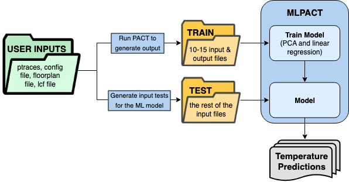

# MLPACT


# Table of Contents

- [Overview](#overview)
- [Installation](#installation)
- [Command Line](#command-line)
- [Configuration](#configuration)
- [Example](#example)
- [Project Structure](#project-structure)


# Overview

MLPACT is a transient thermal predictor that uses PCA dimentionality reductor and a Koopman-inspired linear regression machine learning model.


# Installation

Create a new python environment in the terminal (only needs to be created the first time). Code must be run in python environment to install and use the necessary modules.

```
python3 -m venv <my_env>
```

Activate the environment every time the code is run:

```
source my_env/bin/activate
```

Install necessary modules as needed, based on command line error outputs:

```
pip install pandas matplotlib numpy scipy torch scikit-learn
```

To make sure the correct modules are loaded and the pandas version is correct:

```
module purge
module load openmpi/3.1.4_gnu-10.2.0 xyce/7.4
python -m pip install "pandas==1.5.3"
```


# Command Line
In the src directory, by using the following command, we can run MLPACT:
```
python3 MLPACT_v2.py --modelParamsFile ../Data/example_modelParams.config --configFile ../Data/example_config.config --floorplanFile ../Data/example_flp.csv --lcfFile ../Data/example_lcf.csv --power-data-csv ../Data/example_power_data.csv --ptrace-dir ../Data/example_ptraces/ --output-dir ../Data --n-training-samples 10 --visualize --n-components-features 50 --n-components-targets 50
```

# Configuration

User inputs are as follows:
1. Model parameter file (required)
    1. [PATH] defines the path to the library, ptrace, flp.
    2. [Simulation] defines the simulation type (e.g, steady-state or transient).
    3. [Solver] selects the solver (SuperLU, SPICE_steady, SPICE_transient).
    4. [Grid] is the number of grid cells used in the simulation.
    5. Users can also define the heat sink characteristics, cooling properties, and other cooling options.

2. Config file describes the layer material properties. (required)
    1. Thickness defines the layer thickness.
    2. HTC is the heat transfer coefficient between the ambient and the heat sink.
    3. Thermal resistivity and specific heat capacity are used to calculate the thermal resistor and capacitor values.
    4. [Init] defines the ambient temperature.
    5. Users can select the heat sink as well as its parameters.

3. Floorplan file (.CSV file) describes the chip floorplan. (required)
    1. Depending on the desired simulation granularity, users can define a standard-cell-level chip floorplan with a large number of units or an architecture-level floorplan that includes microarchitectural hardware blocks.
    2. UnitName is the name of the unit.
    3. X and Y define the location of the unit.
    4. Length (m) and Width (m) describe the unit size.
    5. Label describes the material or the cooling property of the unit.

4. lcf File (required)

5. Power data file (required)

6. Power trace directory (required)

7. Output directory (required)
    1. Training files (power/temp pairs)
    2. Testing files (power only)
    3. MLPACT results
 
8. Number of power trace samples (optional; default argument is set to 10)
    1. Number of power trace samples that will be randomly selected from the given directory
    2. Generally recommended to set n between 10 to 15
    3. Make sure there are n or more power traces in the given directory
 
9. Visualization (optional;)
    1. Argument to toggle whether to save temperature output as a heat map (if include --visualize in command) or a .csv file (without --visulize in command)

10. Number of feature components (optional; default is set to 50)
    1. Number of feature components for PCA

11. Number of target components (optional; default is set to 50)
    1. Number of target components for PCA

# Example

The Example Data directory contains the following example files:
1. ModelParams File (example_modelParams.config)
2. Config File (example_config.config)
3. Floorplan File (example_flp.csv)
4. LCF File (example_lcf.csv)
5. Power Data File (example_power_data.csv)
6. Power Trace Directory (example_ptraces/) with 25 example power traces


# Project Structure

The simulation flow of MLPACT is shown in the following image:



<!--  -->

<!--  -->

# Citation
If you use ML-PACT for your publications, please cite our MLCAD and DATE papers [1,3]. If you are using the window-based technique, please cite our ITHERM and DATE papers [2,3].

# References

[1] Mohammadamin Hajikhodaverdian, Sherief Reda, and Ayse K. Coskun. Fast Chip Transient Temperature Simulation via Machine Learning. 2025 7th ACM/IEEE International Symposium on Machine Learning for CAD (MLCAD), Sept. 2025.

[2] Mohammadamin Hajikhodaverdian, Sherief Reda, Ayse K. Coskun. Steady-State Temperature Prediction Based on Compact Thermal Models Using Machine Learning. 2025 24th IEEE Intersociety Conference on Thermal and Thermomechanical Phenomena in Electronic Systems (ITherm), May 2025.

[3] Mohammadamin Hajikhodaverdian, Sherief Reda, Ayse K. Coskun. Fast Machine Learning Based Prediction for Temperature Simulation Using Compact Models (Extended Abstract). 2025 Design, Automation & Test in Europe Conference & Exhibition (DATE), pp. 1-2, April 2025.
