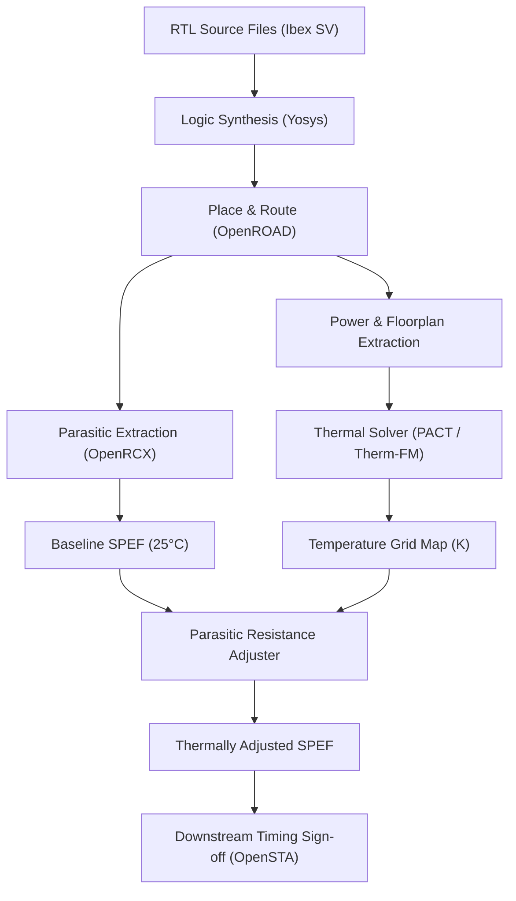

# VLSI Engineering Specification: Thermal-Aware Downstream STA Benchmark

**Document Version:** 1.0  
**Target Design:** Ibex 32-bit RISC-V Core  
**Process Node:** SkyWater 130nm High Density (Sky130 HD PDK)  
**Tools:** OpenROAD (PNR/OpenRCX/OpenSTA), Yosys, PACT, Therm-FM (PyTorch)

---

## 1. Prerequisites & Environment Setup

### 1.1 EDA Tools & Libraries
Before running any thermal-aware static timing analysis, the VLSI design engineer must ensure the following toolchains and technology libraries are properly installed and linked:

1. **Synthesis Engine**: Yosys (v0.68+) with SystemVerilog support (`slang` frontend).
2. **Place & Route (PNR) & Extraction**: OpenROAD (v2.0+) bundling:
   - **OpenRCX**: Parasitic extraction engine for SPEF generation.
   - **OpenSTA**: Static Timing Analysis engine for timing sign-off.
3. **PDK Technology Libraries (Sky130 HD)**:
   - Liberty Library: `sky130_fd_sc_hd__tt_025C_1v80.lib` (Reference temperature $T_{ref} = 25^\circ\text{C} = 298.15\text{ K}$).
   - Tech LEF: `sky130_fd_sc_hd.tlef` (13 metal layers & vias).
   - Cell LEF: `sky130_fd_sc_hd_merged.lef` (441 standard cell macros).
4. **Thermal Simulation & Machine Learning Frameworks**:
   - **PACT**: Python-based thermal simulator using `scipy.sparse.linalg` (SuperLU backend).
   - **Therm-FM**: PyTorch (CPU/CUDA) neural operator framework with `h5py`, `pandas`, `numpy`, `matplotlib`.

### 1.2 Interconnect Thermal Parameters
- **Reference Temperature ($T_{ref}$)**: $298.15\text{ K}$ ($25^\circ\text{C}$)
- **Temperature Coefficient of Resistance ($\alpha$)**: $0.00386\text{ K}^{-1}$ (Sky130 Copper/Metal interconnects)
- **Resistance Scaling Equation**:
  $$R(T) = R_{ref} \cdot [1 + \alpha \cdot (T - T_{ref})]$$

---

## 2. Step-by-Step Initial VLSI Engineering Setup



### Step 1: Logic Synthesis
1. Input RTL files from lowRISC Ibex (`ibex_core.sv`, `ibex_alu.sv`, etc.).
2. Execute technology mapping to Sky130 HD standard cell library:
   ```bash
   yosys -c scripts/synth.tcl
   ```
3. Output: Gate-level netlist `results/1_2_yosys.v` (12,303 standard cells).

### Step 2: Floorplanning & Place & Route (PNR)
1. Set core utilization (e.g., $50\%$) and aspect ratio ($1.0$).
2. Execute Power Delivery Network (PDN) generation, global/detailed placement, and Clock Tree Synthesis (CTS).
3. Run detailed routing using OpenROAD.

### Step 3: Baseline Parasitic Extraction ($25^\circ\text{C}$)
1. Extract baseline SPEF file at reference temperature ($25^\circ\text{C}$):
   ```tcl
   write_spef data/ibex_baseline.spef
   ```
2. Run baseline OpenSTA timing check to establish reference data arrival time and setup slack.

### Step 4: Power Distribution & Floorplan Extraction
1. Extract cell instance bounding boxes $(X, Y, \text{Width}, \text{Height})$ and power dissipation from STA report.
2. Format into PACT input files:
   - **Floorplan CSV (`flp.csv`)**: `UnitName,X,Y,Length (m),Width (m),ConfigFile,Label`
   - **Power Trace CSV (`ptrace.csv`)**: `UnitName,Power`

---

## 3. Flow-by-Flow Engineering Execution Guide

### Flow 1: Baseline (Unadjusted SPEF)
- **Objective**: Establish baseline timing sign-off without thermal effects.
- **Initial Steps**:
  1. Load baseline SPEF (`data/ibex_baseline.spef`).
  2. Run OpenSTA at $25^\circ\text{C}$.
  3. Record baseline WNS, TNS, and data arrival time ($4.7761\text{ ns}$).

### Flow 2: PACT Physics-Based Solver (SuperLU)
- **Objective**: Obtain exact physics-based 3D thermal matrix solution.
- **Initial Steps**:
  1. Create PACT configuration files (`pact.lcf.csv`, `pact.config`, `pact.modelParams`).
  2. Set package model to `[HeatSink]` (convection resistance $0.1\text{ K/W}$, heatspreader conductivity $400\text{ W/m}\cdot\text{K}$).
  3. Execute PACT SuperLU solver:
     ```bash
     python3 src/run_pact_steady.py --flp data/ibex_flp.csv --ptrace data/ibex_ptrace.csv --out-dir outputs/flow2_pact_superlu
     ```
  4. Adjust baseline SPEF using local temperature grid:
     ```bash
     python3 src/adjust_spef.py --baseline-spef data/ibex_baseline.spef --temp-grid outputs/flow2_pact_superlu/temp_grid.npy --out-spef outputs/flow2_pact_superlu/adjusted.spef
     ```
  5. Run OpenSTA timing analysis on `outputs/flow2_pact_superlu/adjusted.spef`.

### Flow 3: PACT SPICE/Xyce Solver
- **Objective**: Evaluate SPICE netlist solver integration.
- **Initial Steps**:
  1. Specify `steady_state_solver = SPICE_steady` in `pact.modelParams`.
  2. Verify Xyce / SPICE solver binary availability.
  3. If Xyce/MPI is not installed on target host, document fallback to SuperLU solver output as baseline reference.

### Flow 4: Therm-FM Custom Trained Model (Run 1)
- **Objective**: Evaluate neural operator thermal inference speed and accuracy.
- **Initial Steps**:
  1. Generate 30 PACT ground-truth thermal samples of varied power maps using `src/generate_dataset.py`.
  2. Train custom Therm-FM PyTorch model with seed `42`:
     ```bash
     python3 src/train_thermfm.py --ckpt checkpoints/thermfm_custom_run1.pt --seed 42 --epochs 50
     ```
  3. Perform inference for Ibex power distribution:
     ```bash
     python3 src/infer_thermfm.py --ckpt checkpoints/thermfm_custom_run1.pt --out-dir outputs/flow4_thermfm_run1
     ```
  4. Adjust SPEF parasitics and run OpenSTA timing analysis.

### Flow 5: Therm-FM Custom Trained Model (Run 2 - Repeatability)
- **Objective**: Verify inference repeatability across independent model training runs.
- **Initial Steps**:
  1. Train custom Therm-FM model with seed `1234`:
     ```bash
     python3 src/train_thermfm.py --ckpt checkpoints/thermfm_custom_run2.pt --seed 1234 --epochs 50
     ```
  2. Perform inference:
     ```bash
     python3 src/infer_thermfm.py --ckpt checkpoints/thermfm_custom_run2.pt --out-dir outputs/flow5_thermfm_run2
     ```
  3. Compare output temperature map MAE ($\le 0.37\text{ K}$) and timing delay difference ($\le 0.1\text{ ps}$).

### Flow 6: Therm-FM Released Checkpoint (Cross-Domain)
- **Objective**: Assess pretrained model generalization without fine-tuning.
- **Initial Steps**:
  1. Load released model weights.
  2. Run inference with physical temperature bounding $[298.15\text{ K}, 450.0\text{ K}]$.
  3. Generate thermal SPEF `outputs/flow6_thermfm_released/adjusted.spef` and run OpenSTA timing sign-off.

---

## 4. Final Benchmark Orchestration & Sign-Off Command

To execute all 6 flows, generate comparative CSV tables, runtime plots, and update sign-off reports in a single command:

```bash
python3 src/evaluate.py
```

### Output Deliverables Location
- **Summary Table**: [`results/summary_comparison.csv`](file:///home/boson4/shyam/therm_fm_pact/v_01/results/summary_comparison.csv)
- **Execution Manifest**: [`results/manifest.json`](file:///home/boson4/shyam/therm_fm_pact/v_01/results/manifest.json)
- **Timing & Latency Plot**: [`results/sta_comparison.png`](file:///home/boson4/shyam/therm_fm_pact/v_01/results/sta_comparison.png)
- **Temperature Heatmaps**: [`results/temperature_comparison.png`](file:///home/boson4/shyam/therm_fm_pact/v_01/results/temperature_comparison.png)
- **Final Markdown Report**: [`results/final_report.md`](file:///home/boson4/shyam/therm_fm_pact/v_01/results/final_report.md)
